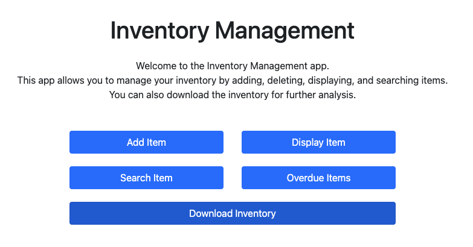
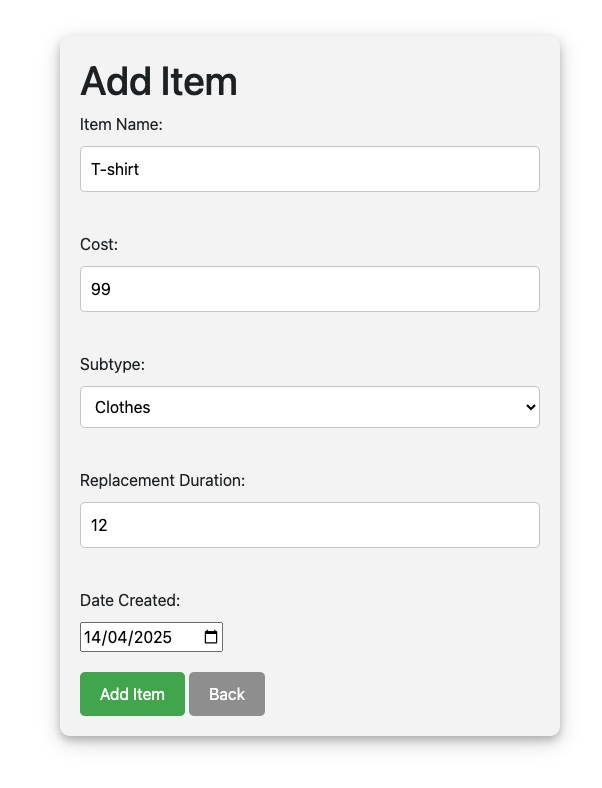
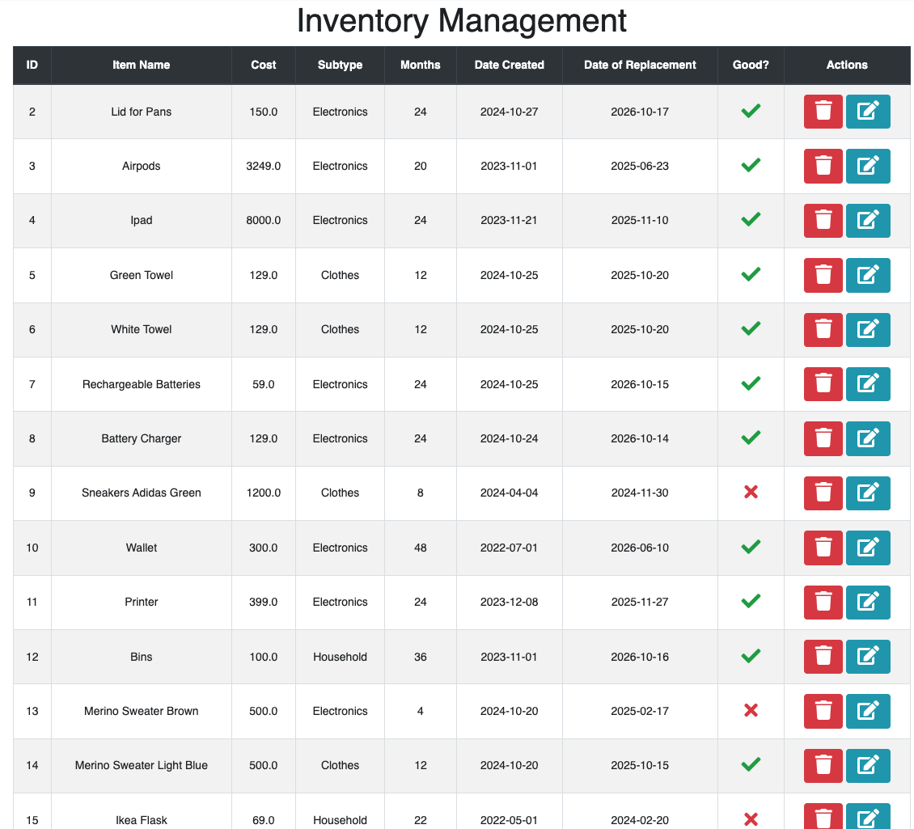

# About


 - **Easy Inventory** helps you manage inventory for personal use.


## Supported Features
1. Add Items
2. Display/Modify/Delete
3. Search Inventory
4. Overdue Items as JSON
5. Export Inventory as CSV


 


## Quick Start

### Setting up Venv for Flask

It is recommended to have flask installed in a venv as the code below suggest. It could be an idea to store this info in a script and run it as needed.

```
python3 -m venv .
source bin/activate
python3 -m pip install flask
```


### Starting the APP
- The app can be started by using the command below
`python app.py`

- There is option to customize the IP address and port inside `app.py`, by default the values are set to `0.0.0.0` or localhost and the port is set to `5000`.

### Useful APIs

|Useful APIs|Function|
|---|---|
| http://127.0.0.1:5000/inventory| Webapp's Menu Page|
| http://127.0.0.1:5000/inventory/add| Add item to inventory|
|http://127.0.0.1:5000/inventory/display| Display all items in inventory |
http://127.0.0.1:5000/inventory/overdue| Get info of all overdue items |
http://127.0.0.1:5000/inventory/display| Display all items in inventory |


### Running Tests

To run the tests, use the following command:

<pre>python3 testInventoryManger.py</pre> 


## Adding an item
 

## Viewing the Inventory



